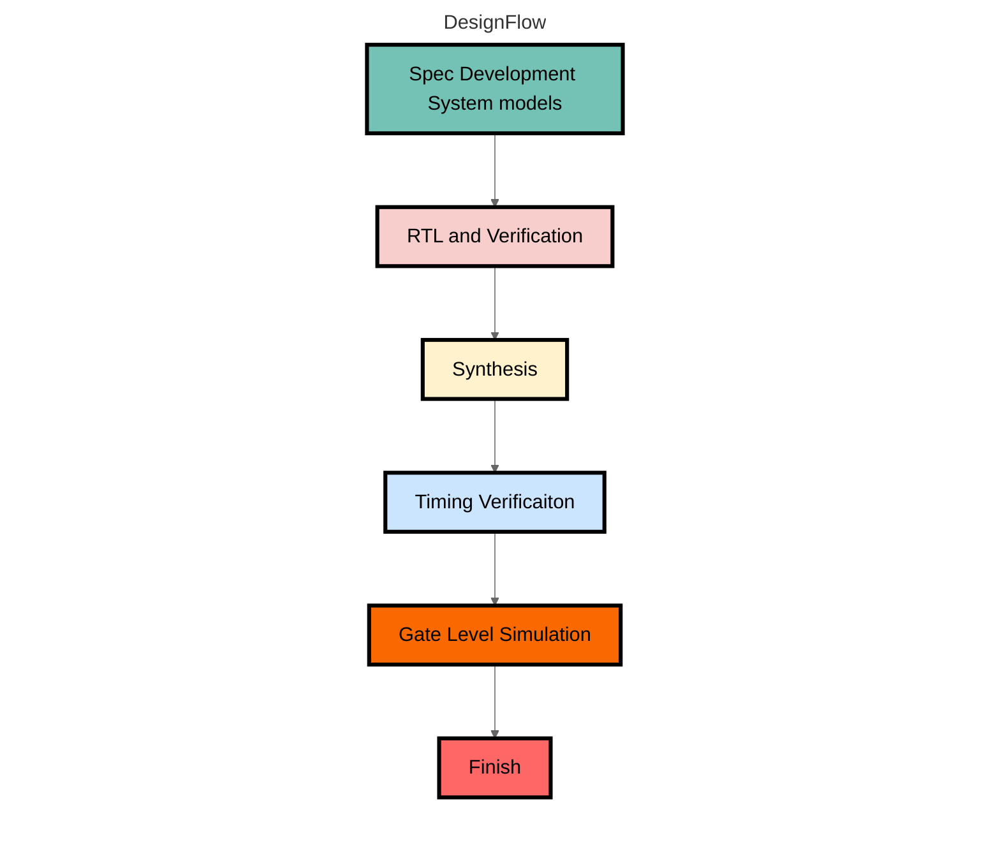

# NYCU Digital Circuit System (2023) - writeup
This repository contained my designs (System Verilog) and patterns (System Verilog & Python3) is used to practice the homeworks and labs from Prof. Tien-Hsuan Chang's Digital Circuit System (DCS) course (2023) at NYCU.

## Outline
### Homeworks
| HW#  | Topic                                              | Design                  | Area        | Data Required Time | Slack (MET) |
| ---- | -------------------------------------------------- | ----------------------- | ----------- | ------------------ | ----------- |
| HW01 | [Simplified Mahjong Judgment](./HW01/DCS_HW01.pdf) | [SMJ.sv](./HW01/SMJ.sv) | 2498.572793 | 30                 | 16.62       |
| HW02 | [Simplified I2C](./HW02/DCS_HW02.pdf)              |                         |             |                    |             |
| HW03 | [Traffic Light Controller](./HW03/DCS_HW03.pdf)    |                         |             |                    |             |
| HW04 | [Histogram Equalizer](./HW04/DCS_HW04.pdf)         |                         |             |                    |             |
| HW05 | [MIPS CPU](./HW05/DCS_HW05.pdf)                    |                         |             |                    |             |

### Labs
| Lab#  | Topic                                               |                                  | Area        | Data Required Time | Slack (MET) |
| ----- | --------------------------------------------------- | -------------------------------- | ----------- | ------------------ | ----------- |
| Lab01 | [Binary-Coded Decimal](./Lab01/DCS_Lab01.pdf)       | [BCD.sv](./Lab01/BCD.sv)         | 483.758996  | 12                 | 8.23        |
| Lab02 | [Merge Sort](./Lab02/DCS_Lab02.pdf)                 | [Sort.sv](./Lab02/Sort.sv)       | 1568.397579 | 10                 | 0.12        |
| Lab03 | [Frequency Divider](./Lab03/DCS_Lab03.pdf)          | [Counter.sv](./Lab03/Counter.sv) | 74.685597   | 5                  | 4.17        |
| Lab04 | [Sequential Circuit](./Lab04/DCS_Lab04.pdf)         | [Seq.sv](./Lab04/Seq.sv)         | 565.234189  | 9.79               | 3.63        |
| Lab05 | [AHB Interconnect](./Lab05/DCS_Lab05.pdf)           |                                  |             |                    |             |
| Lab06 | [Pattern](./Lab06/DCS_Lab06.pdf)                    |                                  |             |                    |             |
| Lab07 | [Matrix Multiplication](./Lab07/DCS_Lab07.pdf)      | [DCT.sv](./Lab07/DCT.sv)         | 37570.25095 | 7.78               | 2.68        |
| Lab08 | [Floating Point Computation](./Lab08/DCS_Lab08.pdf) |                                  |             |                    |             |
| Lab09 | [Pipeline](./Lab09/DCS_Lab09.pdf)                   |                                  |             |                    |             |
| Lab10 | [Clock Domain Crossing](./Lab10/DCS_Lab10.pdf)      |                                  |             |                    |             |

### Online Test
| Topic                         | Design | Area | Data Required Time | Slack (MET) |
| ----------------------------- | ------ | ---- | ------------------ | ----------- |
| [Systolic Array](./OT/OT.pdf) |        |      |                    |             |

### Final Project
| Topic                                       | Design | Area | Data Required Time | Slack (MET) |
| ------------------------------------------- | ------ | ---- | ------------------ | ----------- |
| [Simple CNN](./Final/DCS_Final_Project.pdf) |        |      |                    |             |

## Design Flow


## Usage
```shell
# RTL & Verification
$ make irun_rtl

# Install Python3 thirdparty library (Optional)
$ pip3 install -r requirements.txt

# Use Python3 to generate custom testcase (Optional)
$ python3 testdata_gen.py

# RTL & Verification with custom testcase
$ make irun_rtl_cust

# Synthesis & STA report
$ make syn

# Gate level simulation
$ make irun_gate

# Gate level simulation with custom testcase
$ make irun_gate_cust

# View waveform
$ make nWave

# Debug design and check critical path
$ make verdi_rtl
$ make verdi_gate

# Clean output file
$ make clean
```

## Tool Chain
* Python3
* Cadence irun
* Synopsys Design Compiler
    * cell : `TSMC 0.13um`
* Synopsys Verdi

## References
* Course video playlist (2023): [Link](https://www.youtube.com/playlist?list=PLCUEmRsKEgZ4p8HK5IXMrohliNuRttqpt)