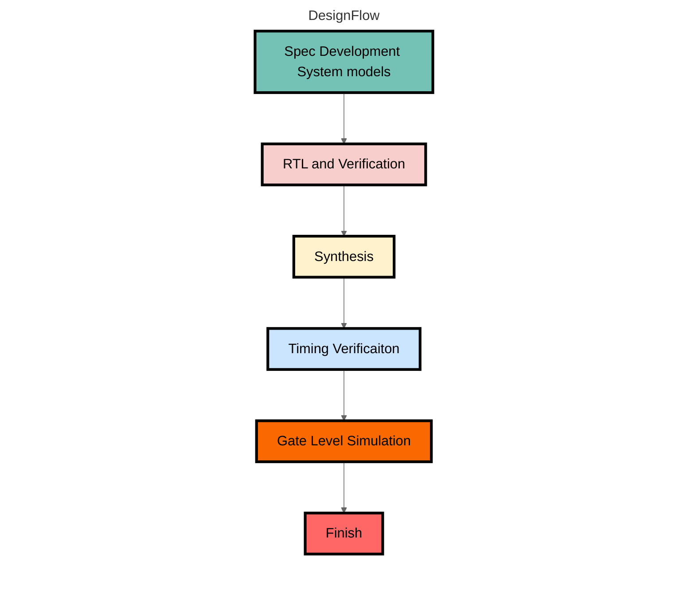

# NYCU Digital Circuit System - writeup
This repository contained my designs (System Verilog) and patterns (System Verilog & Python3) is used to practice the homeworks and labs from Prof. Tien-Hsuan Chang's Digital Circuit System (DCS) course (2022 ~ 2025) at NYCU.

## Outline

### 2022
<details open>
<summary>More</summary>

| #     | Topic                                                        | 00_TESTED | 01_RTL | 02_SYN | 03_GATE |
| ----- | ------------------------------------------------------------ | --------- | ------ | ------ | ------- |
| Lab01 | [Combinational](./2022/Lab01/DCS_Lab01.pdf)                  | ✅         | ✅      | ✅      | ✅       |
| Lab02 | [Timer](./2022/Lab02/DCS_Lab02.pdf)                          | ✅         | ✅      | ✅      | ✅       |
| Lab03 | [Maxmin](./2022/Lab03/DCS_Lab03.pdf)                         | ✅         | ✅      | ✅      | ✅       |
| Lab04 | [Sequence](./2022/Lab04/DCS_Lab04.pdf)                       | ✅         | ✅      | ✅      | ✅       |
| Lab05 | [AHB interconnect](./2022/Lab05/DCS_Lab05.pdf)               |           |        |        |         |
| Lab06 | [Floating Point Computation](./2022/Lab06/DCS_Lab06.pdf)     |           |        |        |         |
| Lab07 | [Pattern](./2022/Lab07/DCS_Lab07.pdf)                        |           |        |        |         |
| Lab08 | [Pipeline](./2022/Lab08/DCS_Lab08.pdf)                       |           |        |        |         |
| Lab09 | [Clock Domain Crossing](./2022/Lab09/DCS_Lab09.pdf)          |           |        |        |         |
| HW01  | [Calculate Numbers](./2022/HW01/DCS_HW01.pdf)                | ✅         | ✅      | ✅      | ✅       |
| HW02  | [Visa Check Digit](./2022/HW02/DCS_HW02.pdf)                 |           |        |        |         |
| HW03  | [Vending Machine](./2022/HW03/DCS_HW03.pdf)                  |           |        |        |         |
| HW04  | [MIPS CPU with Pipeline](./2022/HW04/DCS_HW04.pdf)           |           |        |        |         |
| HW05  | [Convolution](./2022/HW05/DCS_HW05.pdf)                      |           |        |        |         |
| OT    | [Divider](./2022/OT/OT.pdf)                                  |           |        |        |         |
| FP    | [Job Assignment Machine](./2022/Final/DCS_Final_Project.pdf) |           |        |        |         |

</details>

### 2023
<details open>
<summary>More</summary>

| #     | Topic                                                    | 00_TESTED | 01_RTL | 02_SYN | 03_GATE |
| ----- | -------------------------------------------------------- | --------- | ------ | ------ | ------- |
| Lab01 | [Binary-Coded Decimal](./2023/Lab01/DCS_Lab01.pdf)       | ✅         | ✅      | ✅      | ✅       |
| Lab02 | [Merge Sort](./2023/Lab02/DCS_Lab02.pdf)                 | ✅         | ✅      | ✅      | ✅       |
| Lab03 | [Frequency Divider](./2023/Lab03/DCS_Lab03.pdf)          | ✅         | ✅      | ✅      | ✅       |
| Lab04 | [Sequential Circuit](./2023/Lab04/DCS_Lab04.pdf)         | ✅         | ✅      | ✅      | ✅       |
| Lab05 | [AHB Interconnect](./2023/Lab05/DCS_Lab05.pdf)           | ✅         | ✅      | ✅      | ✅       |
| Lab06 | [Pattern](./2023/Lab06/DCS_Lab06.pdf)                    | ✅         | ✅      | ❌      | ❌       |
| Lab07 | [Matrix Multiplication](./2023/Lab07/DCS_Lab07.pdf)      | ✅         | ✅      | ✅      | ✅       |
| Lab08 | [Floating Point Computation](./2023/Lab08/DCS_Lab08.pdf) | ✅         | ✅      | ✅      | ✅       |
| Lab09 | [Pipeline](./2023/Lab09/DCS_Lab09.pdf)                   | ✅         | ✅      | ✅      | ✅       |
| Lab10 | [Clock Domain Crossing](./2023/Lab10/DCS_Lab10.pdf)      | ✅         | ✅      | ✅      | ✅       |
| HW01  | [Simplified Mahjong Judgment](./2023/HW01/DCS_HW01.pdf)  | ✅         | ✅      | ✅      | ✅       |
| HW02  | [Simplified I2C](./2023/HW02/DCS_HW02.pdf)               | ✅         | ✅      | ✅      | ✅       |
| HW03  | [Traffic Light Controller](./2023/HW03/DCS_HW03.pdf)     |           |        |        |         |
| HW04  | [Histogram Equalizer](./2023/HW04/DCS_HW04.pdf)          |           |        |        |         |
| HW05  | [MIPS CPU](./2023/HW05/DCS_HW05.pdf)                     |           |        |        |         |
| OT    | [Systolic Array](./2023/OT/OT.pdf)                       |           |        |        |         |
| FP    | [Simple CNN](./2023/Final/DCS_Final_Project.pdf)         |           |        |        |         |

</details>

### 2024
<details open>
<summary>More</summary>

| #     | Topic                                                   | 00_TESTED | 01_RTL | 02_SYN | 03_GATE |
| ----- | ------------------------------------------------------- | --------- | ------ | ------ | ------- |
| Lab01 | [Combinational](./2024/Lab01/DCS_Lab01.pdf)             | ✅         | ✅      | ✅      | ✅       |
| Lab02 | [Merge Sort](./2024/Lab02/DCS_Lab02.pdf)                | ✅         | ✅      | ✅      | ✅       |
| Lab03 | [SIPO Shift Register](./2024/Lab03/DCS_Lab03.pdf)       | ✅         | ✅      | ✅      | ✅       |
| Lab04 | [Sequential Circuit](./2024/Lab04/DCS_Lab04.pdf)        | ✅         | ✅      | ✅      | ✅       |
| Lab05 | [AHB interconnect](./2024/Lab05/DCS_Lab05.pdf)          |           |        |        |         |
| Lab06 | [Pattern](./2024/Lab06/DCS_Lab06.pdf)                   |           |        |        |         |
| Lab07 | [Pipeline](./2024/Lab07/DCS_Lab07.pdf)                  |           |        |        |         |
| Lab08 | [Pipeline](./2024/Lab08/DCS_Lab08.pdf)                  |           |        |        |         |
| Lab09 | [Low-pass FIR filter](./2024/Lab09/DCS_Lab09.pdf)       |           |        |        |         |
| Lab10 | [Clock Domain Crossing](./2024/Lab10/DCS_Lab10.pdf)     |           |        |        |         |
| HW01  | [Calculation Task](./2024/HW01/DCS_HW01.pdf)            | ✅         | ✅      | ✅      | ✅       |
| HW02  | [Identification Number Check](./2024/HW02/DCS_HW02.pdf) |           |        |        |         |
| HW03  | [DCSTCO supermarket](./2024HW03/DCS_HW03.pdf)           |           |        |        |         |
| HW04  | [Motion Estimation](./2024/HW04/DCS_HW04.pdf)           |           |        |        |         |
| HW05  | [Simple MIPS CPU](./2024/HW05/DCS_HW05.pdf)             |           |        |        |         |
| OT    | [Linear Programming](./2024/OT/OT.pdf)                  |           |        |        |         |
| FP    | [DCSformer](./2024/Final/DCS_Final_Project.pdf)         |           |        |        |         |

</details>

### 2025
<details open>
<summary>More</summary>

| #     | Topic                                                                           | 00_TESTED | 01_RTL | 02_SYN | 03_GATE |
| ----- | ------------------------------------------------------------------------------- | --------- | ------ | ------ | ------- |
| Lab01 | [Combinational Circuit](./2025/Lab01/DCS_Lab01.pdf)                             | ✅         | ✅      | ✅      | ✅       |
| Lab02 | [Counter](./2025/Lab02/DCS_Lab02.pdf)                                           |           |        |        |         |
| Lab03 | [Sequential Circuit 2](./2025/Lab03/DCS_Lab03.pdf)                              |           |        |        |         |
| Lab04 | [Synchronous FIFO](./2025/Lab04/DCS_Lab04.pdf)                                  |           |        |        |         |
| Lab05 | [Finite State Machine](./2025/Lab05/DCS_Lab05.pdf)                              |           |        |        |         |
| Lab06 | [Pattern](./2025/Lab06/DCS_Lab06.pdf)                                           |           |        |        |         |
| Lab07 |                                                                                 |           |        |        |         |
| Lab08 | [Channel and Interface](./2025/Lab08/DCS_Lab08.pdf)                             |           |        |        |         |
| Lab09 | [Pipeline/FIR filter](./2025/Lab09/DCS_Lab09.pdf)                               |           |        |        |         |
| Lab10 | [Clock Domain Crossing](./2025/Lab10/DCS_Lab10.pdf)                             |           |        |        |         |
| HW01  | [Simple Data Transfer](./2025/HW01/DCS_HW01.pdf)                                |           |        |        |         |
| HW02  | [GCD Compression](./2025/HW02/DCS_HW02.pdf)                                     |           |        |        |         |
| HW03  | [Sparse Matrix Calculator](./2025/HW03/DCS_HW03.pdf)                            |           |        |        |         |
| HW04  | [MAC Array for Matrix Multiplication and Convolution](./2025/HW04/DCS_HW04.pdf) |           |        |        |         |
| HW05  | [Simple CPU](./2025/HW05/DCS_HW05.pdf)                                          |           |        |        |         |
| OT    | [Layer Normalization](./2025/OT/OT.pdf)                                         |           |        |        |         |
| FP    | [Transformer-based AI Accelerator](./2025/Final/DCS_Final_Project.pdf)          |           |        |        |         |

</details>

## Design Flow


## Usage
```shell
# RTL & Verification
$ make irun_rtl
$ make vcs_rtl

# Install Python3 thirdparty library (Optional)
$ pip3 install -r requirements.txt

# Use Python3 to generate custom testcase (Optional)
$ python3 testdata_gen.py

# RTL & Verification with custom testcase
$ make irun_rtl_cust

# Synthesis & STA report
$ make syn

# Gate level simulation
$ make irun_gate
$ make vcs_gate

# Gate level simulation with custom testcase
$ make irun_gate_cust

# View waveform
$ make nWave

# Debug design and check critical path
$ make verdi_rtl
$ make verdi_gate

# Clean output file
$ make clean
```

## Tool Chain
* Cadence irun
* Synopsys VCS
* Synopsys Design Compiler
* Synopsys Verdi
* Process : `UMC 0.18µm` (Not provide in this repository)
